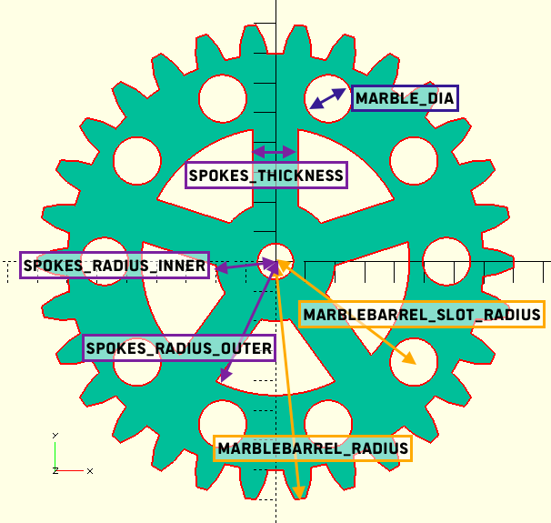

# Murmelbahnen
Ein Projekt von peter und cyberkeiler.

## Fördermechanismen
### Förderrad

    // Marble Setup
    marble_dia = 1.6; // The Diameter of your Marbles

    //Marble Barrel Setup
    marblebarrel_radius = 0;     // The Radius of the Barrel + Marbleradius!
    marblebarrel_slot_radius = 5.75; // Radius to center of slots
    marblebarrel_slot_n = 10;  // Amount of Slots in Barrel

    // Spokes Setup
    spokes_use = true;
    spokes_radius_outer = 4.5;
    spokes_radius_inner = 2.0;
    spokes_thickness = 1.5;
    spokes_amount = 5;

    // Center Hole
    axis_use = true;
    axis_radius = 0.6;
